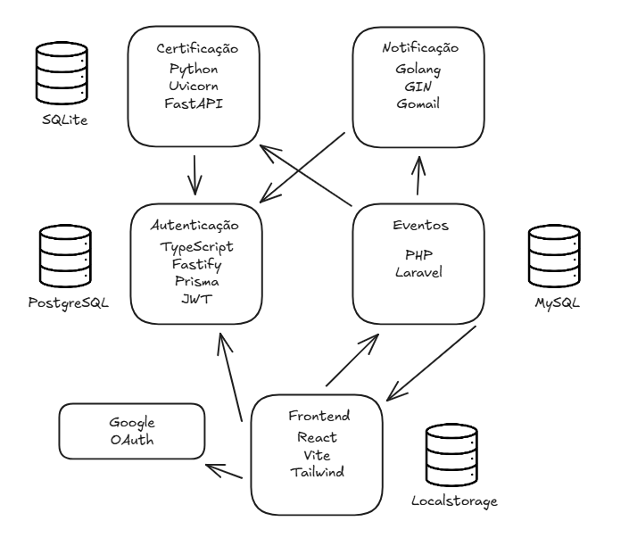
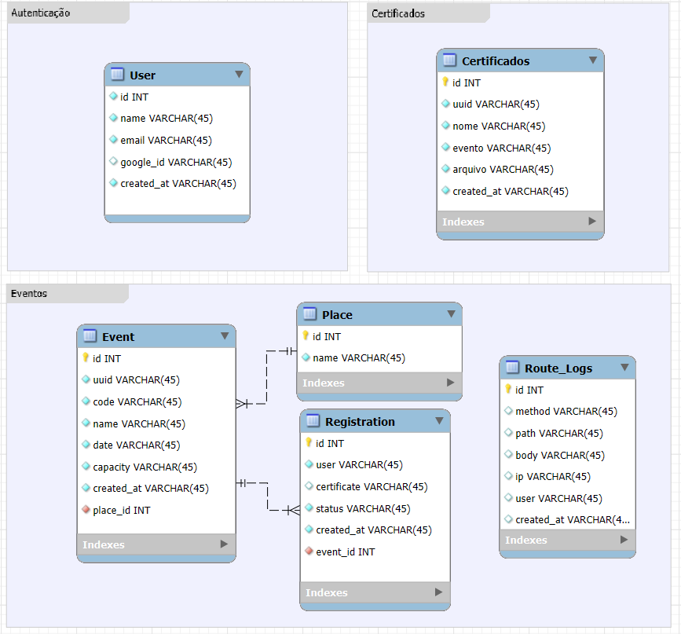

# Sistema de Eventos - Microsserviços

## Descrição do Projeto
Sistema de gerenciamento de eventos, onde usuários podem se cadastrar, pesquisar eventos, inscrever-se, registrar presença, emitir certificados e validar certificados. O sistema suporta operações offline para check-in e sincronização posterior com o servidor.

---

## Funcionalidades Principais
1. Cadastro do usuário
2. Login
3. Consulta de inscrição
4. Cancelamento de inscrição
5. Registro de presença
6. Inscrição rápida
7. Inscrição completa (complemento de dados no portal)
8. Emissão de certificado
9. Validação de certificado
10. Envio de e-mail automático nas seguintes condições:
   - Inscrição
   - Cancelamento
   - Comparecimento (check-in)

---

## Fluxo Offline
- Participante chega sem internet:
  - Cadastro rápido (se não estiver cadastrado)
  - Inscrição no evento
  - Registro de presença
- Sincronização manual dos dados quando a internet estiver disponível.

---

## Controle de Acesso
- Todas as requisições são autenticadas.
- Logs de todas as requisições são gerados.

---

## Roteiro de Testes

### Caso 1: Fluxo Tradicional
1. Listar eventos no portal
2. Consultar detalhes de um evento
3. Cadastrar participante 1
4. Login do participante 1
5. Inscrever participante 1
6. Registrar presença do participante 1
7. Verificar registro de presença no portal

### Caso 2: Operações Offline
1. Cadastrar participante 2 e inscrever no evento (sem registrar presença)
2. Sincronizar dados com ambiente local
3. Simular ausência de rede
4. Cadastrar participante 3
5. Inscrever participante 3
6. Registrar presença do participante 3
7. Restaurar conexão e sincronizar dados
8. Verificar no portal: participante 3, inscrição e presença

### Caso 3: Complemento de dados, certificados e e-mails
1. Participante 3 completa dados
2. Participante 3 emite certificado
3. Participante 3 valida certificado
4. Participante 2 cancela inscrição
5. Apresentar e-mails de inscrição, comparecimento e cancelamento

---

## Observações
- Cadastro simplificado para início de uso.
- Cada evento possui template de certificado.
- Operações offline permitem registro e sincronização posterior.


---

# Documentação de APIs - Microserviços

> Todas as rotas requerem **Bearer Token (JWT)** no header `Authorization`.


## Notification Service

| Método | Rota | URL | Body |
|--------|------|-----|------|
| POST | /send-email | `http://nicolas-deves.duckdns.org:3007/send-email` | ```json { "to": "NOME_DO_DESTINATARIO", "subject": "ASSUNTO_DO_EMAIL", "message": "MENSAGEM_DO_EMAIL" } ``` |

---

## Certification Service

| Método | Rota | URL | Body |
|--------|------|-----|------|
| POST | /gerar-certificado/CURSO/USUARIO | `http://nicolas-deves.duckdns.org:8001/gerar-certificado/CURSO/USUARIO` | - |
| GET  | /baixar-certificado/ARQUIVO_UUID | `http://nicolas-deves.duckdns.org:8001/baixar-certificado/ARQUIVO_UUID` | - |
| GET  | /validar-certificado/ARQUIVO_UUID | `http://nicolas-deves.duckdns.org:8001/validar-certificado/ARQUIVO_UUID` | - |

---

## Registration Service

| Método | Rota | URL | Body |
|--------|------|-----|------|
| GET | /registrations | `http://nicolas-deves.duckdns.org:8000/registrations` | - |
| GET | /registrations/user/USER_ID | `http://nicolas-deves.duckdns.org:8000/registrations/user/USER_ID` | - |
| POST | /registrations | `http://nicolas-deves.duckdns.org:8000/registrations` | ```json { "eventId": EVENT_ID } ``` |
| POST | /registrations/event/EVENT_ID/register-user | `http://nicolas-deves.duckdns.org:8000/registrations/event/EVENT_ID/register-user` | ```json { "user": USER_ID } ``` |
| GET | /registrations/REGISTRATION_ID | `http://nicolas-deves.duckdns.org:8000/registrations/REGISTRATION_ID` | - |
| PUT | /registrations/REGISTRATION_ID/confirm | `http://nicolas-deves.duckdns.org:8000/registrations/REGISTRATION_ID/confirm` | - |
| DELETE | /registrations/REGISTRATION_ID | `http://nicolas-deves.duckdns.org:8000/registrations/REGISTRATION_ID` | - |

---

## Event Service

| Método | Rota | URL | Body |
|--------|------|-----|------|
| GET | /events/EVENT_ID | `http://nicolas-deves.duckdns.org:8000/events/EVENT_ID` | - |
| GET | /events | `http://nicolas-deves.duckdns.org:8000/events` | - |
| GET | /events/admin | `http://nicolas-deves.duckdns.org:8000/events/admin` | - |
| GET | /events/my | `http://nicolas-deves.duckdns.org:8000/events/my` | - |
| GET | /events/confirmed-events | `http://nicolas-deves.duckdns.org:8000/events/confirmed-events` | - |
| POST | /events | `http://nicolas-deves.duckdns.org:8000/events` | ```json { "code": "CODIGO_DO_EVENTO", "name": "NOME_DO_EVENTO", "date": "AAAA-MM-DD HH:MM", "capacity": CAPACIDADE, "place_id": PLACE_ID, "event_type_id": EVENT_TYPE_ID } ``` |

---

## Auth Service

| Método | Rota | URL | Body |
|--------|------|-----|------|
| GET | /auth/user/USER_ID | `http://nicolas-deves.duckdns.org:3000/auth/user/USER_ID` | - |
| POST | /auth/verify-jwt | `http://nicolas-deves.duckdns.org:3000/auth/verify-jwt` | - |
| GET | /auth/me | `http://nicolas-deves.duckdns.org:3000/auth/me` | - |
| POST | /auth/refresh | `http://nicolas-deves.duckdns.org:3000/auth/refresh` | - |
| POST | /auth/login | `http://nicolas-deves.duckdns.org:3000/auth/login` | ```json { "name": "NOME_DO_USUARIO", "email": "EMAIL_DO_USUARIO", "sub": "SUB_DO_USUARIO" } ``` |
| POST | /auth/quick-register | `http://nicolas-deves.duckdns.org:3000/auth/quick-register` | ```json { "name": "NOME_DO_USUARIO", "email": "EMAIL_DO_USUARIO" } ``` |

---

## Arquitetura



## Modelo ER




